# Proyecto 9 - Certificados digitales (Parte 2)

**Fecha:** 29 de abril de 2026  
**Autor:** Javier Calvillo  

## Índice

1. [Introducción](#1-introducción)
2. [Despliegue del servidor web](#2-despliegue-del-servidor-web)
3. [Configuración del dominio](#3-configuración-del-dominio)
4. [Instalación del certificado SSL](#4-instalación-del-certificado-ssl)
5. [Acceso mediante HTTPS](#5-acceso-mediante-https)
6. [Análisis de certificado de sitio real](#6-análisis-de-certificado-de-sitio-real)
7. [Comparativa](#7-comparativa)
8. [Problemas y solución](#8-problemas-y-solución)
9. [Conclusión](#9-conclusión)

---

## 1. Introducción

En esta segunda parte del proyecto, el objetivo principal es desplegar un servidor web en un entorno realista, asegurando la comunicación entre el cliente y el servidor mediante HTTPS.

Para lograrlo, he utilizado una máquina virtual en AWS (Amazon Web Services), donde he configurado un servidor Apache. Posteriormente, le he asignado un nombre de dominio gratuito y he generado un certificado digital mediante Let's Encrypt para cifrar las conexiones.

Finalmente, realizaré una comparativa entre el certificado generado para mi servidor y el que utiliza un sitio web de gran envergadura como Google, para entender las diferencias en su implementación y alcance.

## 2. Despliegue del servidor web

El primer paso ha consistido en lanzar una instancia EC2 en AWS utilizando Ubuntu como sistema operativo de la capa gratuita.

Una vez que la máquina estaba corriendo y se le había asignado una dirección IPv4 pública (en mi caso, la `16.171.142.94`), me conecté por SSH para instalar el servidor web Apache2. Además, fue fundamental configurar las reglas del grupo de seguridad de AWS (Security Group) al momento de lanzarla para permitir el tráfico entrante por los puertos 80 (HTTP) y 443 (HTTPS), ya que sin esto el servidor sería inaccesible desde el exterior.

**Evidencias:**

*Selección del servicio EC2 en la consola de AWS:*
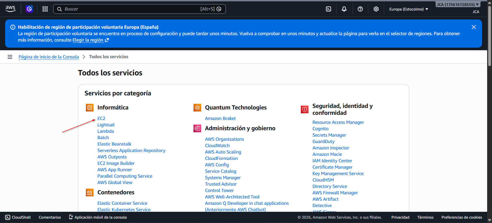

*Configuración de la instancia y reglas de seguridad al crearla:*
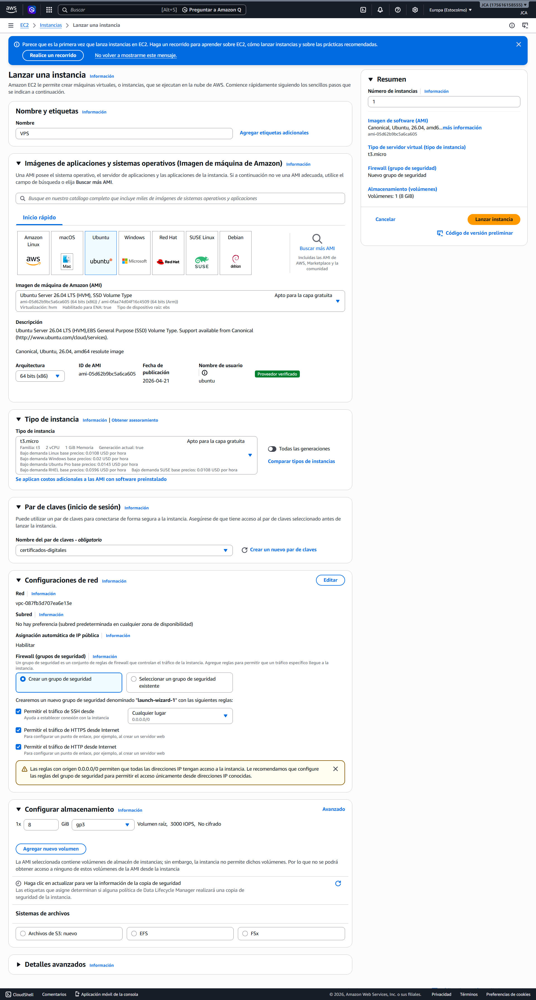

*Instancia corriendo con su IP pública visible:*
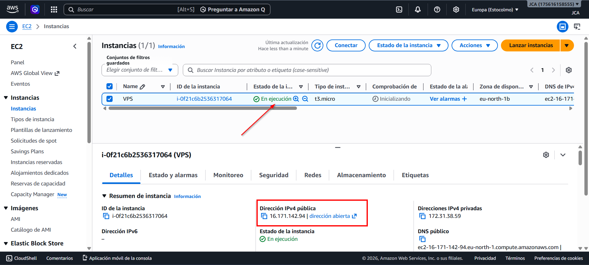

*Reglas del Security Group con los puertos 80, 443 y 22 abiertos:*
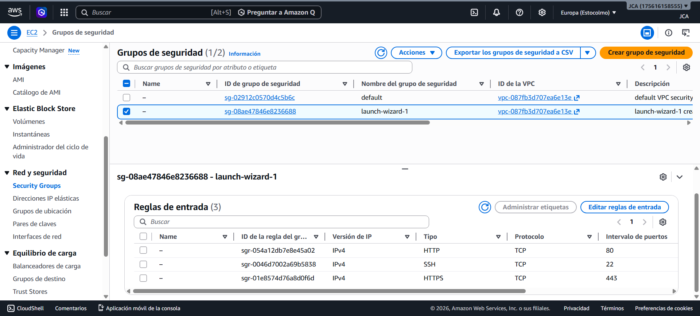

*Instalación del servidor Apache2 desde la terminal:*
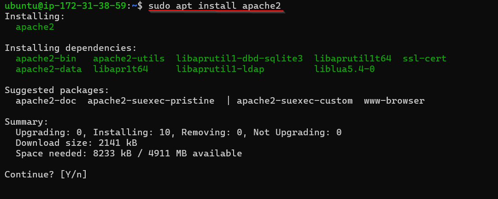

## 3. Configuración del dominio

Para no tener que acceder al servidor mediante la IP pública, lo cual es poco práctico y no permite generar el certificado SSL de forma estándar, he utilizado DuckDNS para crear un dominio dinámico gratuito.

He registrado el dominio `proyecto-javi-aws.duckdns.org` y lo he vinculado a la IP pública de mi instancia de AWS. De esta forma, cualquier persona que acceda a esa URL será redirigida automáticamente a mi servidor Apache.

**Evidencias:**

*Creación de la cuenta en DuckDNS:*
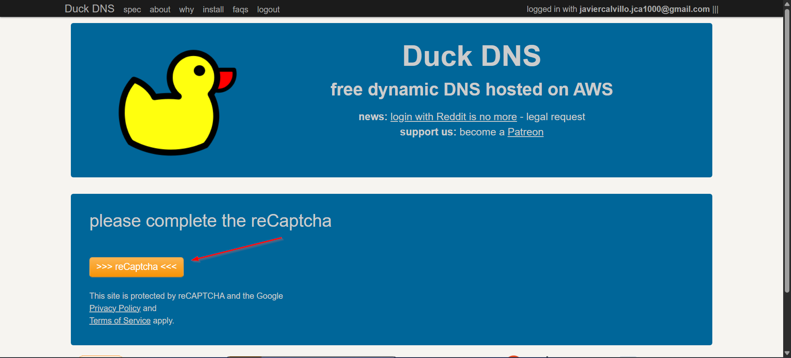

*Registro del subdominio `proyecto-javi-aws`:*
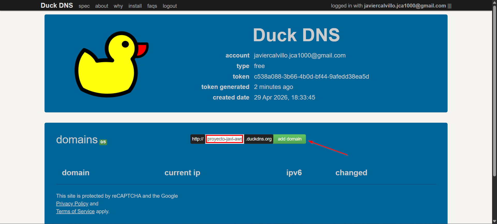

*Vinculación del dominio con la IP pública de AWS:*
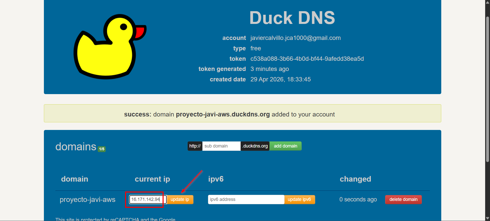

*Comprobación de que el dominio resuelve a mi servidor web (aún sin HTTPS, mostrando aviso de "No es seguro"):*
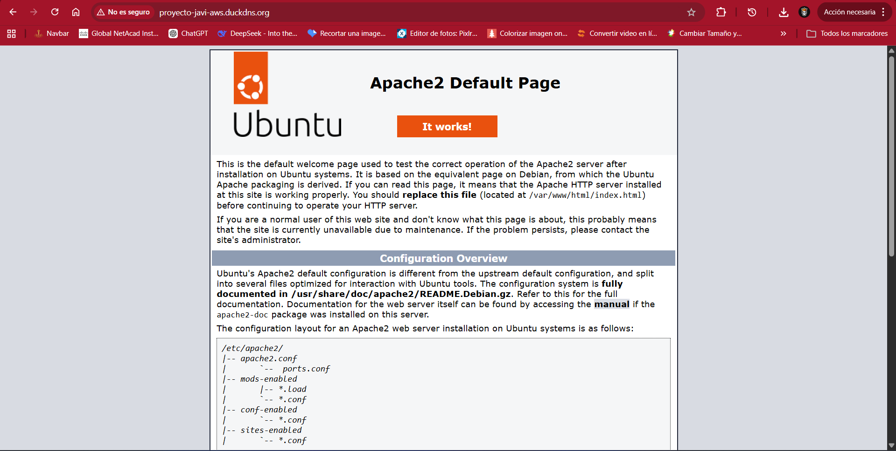

## 4. Instalación del certificado SSL

Con el servidor y el dominio listos, el siguiente paso ha sido asegurar la conexión. Para ello, he utilizado Certbot, una herramienta que automatiza la obtención e instalación de certificados de Let's Encrypt.

Primero instalé los paquetes necesarios (`certbot` y `python3-certbot-apache`) y luego ejecuté el comando `sudo certbot --apache`. Durante el proceso interactivo, proporcioné mi correo electrónico, acepté los términos de servicio, introduje mi dominio completo (`proyecto-javi-aws.duckdns.org`) y dejé que Certbot hiciera el resto. El programa modificó la configuración de Apache automáticamente para redirigir el tráfico y dejó el certificado funcionando a la perfección.

**Evidencias:**

*Instalación de Certbot y dependencias:*
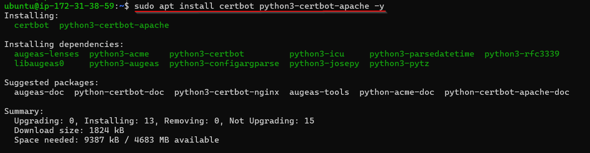

*Proceso de generación del certificado y mensaje de éxito final ("Congratulations!"):*
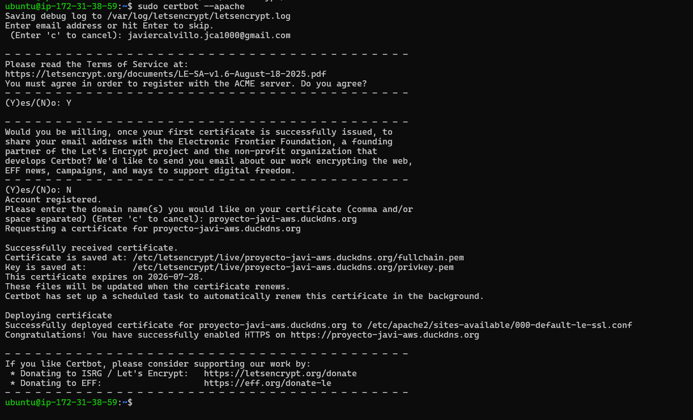

*Verificación de los certificados activos instalados en el servidor:*
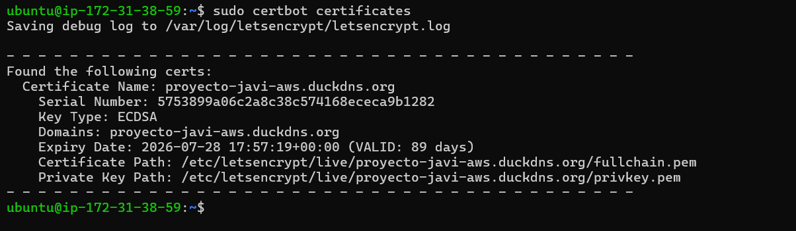

## 5. Acceso mediante HTTPS

Tras finalizar la instalación, comprobé desde mi navegador web que todo funcionaba correctamente. Al entrar en `https://proyecto-javi-aws.duckdns.org`, la página cargó la pantalla por defecto de Apache ("Apache2 Default Page"), pero esta vez acompañada del candado de seguridad en la barra de direcciones.

Al inspeccionar los detalles del certificado desde el navegador, se puede verificar que la conexión está cifrada, que es segura y que el emisor ha sido Let's Encrypt.

**Evidencia:**

*Datos del certificado digital de mi sitio mostrando el emisor (Let's Encrypt) y las fechas de validez:*
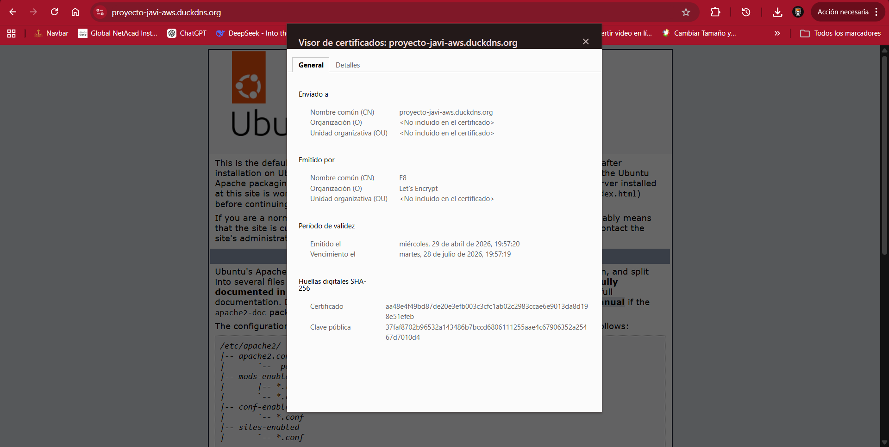

## 6. Análisis de certificado de sitio real

Para entender mejor cómo se aplican estos certificados en el mundo laboral, he analizado el certificado de uno de los sitios más visitados del mundo: Google (`https://www.google.com`).

**Certificado de Google:**
Está emitido por "Google Trust Services", una Autoridad de Certificación (CA) propia de la empresa. Al inspeccionarlo, vemos que está emitido a nombre de `*.google.com`, lo que significa que es un certificado *Wildcard* capaz de asegurar cualquier subdominio bajo google.com. Esto es típico de infraestructuras masivas que necesitan proteger infinidad de servicios simultáneamente sin tener que emitir un certificado distinto para cada uno de ellos.

**Certificado de mi proyecto:**
Mi certificado está emitido por Let's Encrypt, es completamente gratuito y de "Validación de Dominio" (DV). Está emitido única y exclusivamente para el subdominio `proyecto-javi-aws.duckdns.org` de forma específica.

**Evidencia:**

*Datos del certificado de Google:*
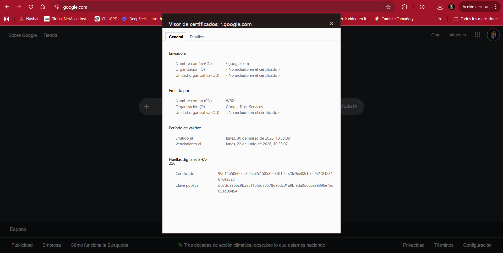

## 7. Comparativa

Al poner ambos certificados frente a frente, encontramos varias similitudes y diferencias marcadas.

**Similitudes:**
- Ambos cumplen el propósito fundamental de cifrar la comunicación entre el navegador del usuario y el servidor.
- Ambos son reconocidos por los navegadores web modernos como válidos y dignos de confianza (muestran el candado).
- Ambos utilizan algoritmos robustos para proteger la información en tránsito y evitar su interceptación.

**Diferencias principales:**
- **Entidad emisora:** El mío lo emite una entidad gratuita sin ánimo de lucro (Let's Encrypt), mientras que el de Google está emitido por su propia entidad corporativa (Google Trust Services).
- **Alcance del dominio:** El mío sirve para un único dominio específico, el de Google es *Wildcard* (`*.google.com`), cubriendo todos los subdominios que dependan de él.
- **Validación:** El mío es de Validación de Dominio (solo verifica que yo controlo el registro DNS en DuckDNS), mientras que las grandes empresas suelen usar validaciones de organización más estrictas (OV o EV) para demostrar su identidad corporativa real ante el navegador.

## 8. Problemas y solución

Durante el desarrollo de esta práctica, me encontré con un pequeño inconveniente al intentar instalar Certbot. La terminal me arrojó un error indicando que no encontraba el paquete (`Package 'certbot' has no installation candidate`).

Rápidamente me di cuenta de que mi servidor AWS estaba recién creado y la lista interna de repositorios estaba desactualizada. Lo solucioné ejecutando primero el comando `sudo apt update` para refrescar los paquetes del sistema y, a continuación, volví a lanzar el comando de instalación de Certbot, que esta vez funcionó de forma fluida. También tuve en cuenta de antemano abrir correctamente los puertos 80 y 443 en el *Security Group* de AWS, lo que me evitó problemas de conectividad posteriores.

## 9. Conclusión

Esta segunda parte del proyecto ha sido muy satisfactoria y útil para asimilar el proceso de despliegue web seguro de forma muy práctica. Partir desde cero configurando la máquina en la nube, asignando el dominio dinámico y, sobre todo, implementando el HTTPS con Let's Encrypt, me ha dado una visión realista de cómo se aseguran los sitios web hoy en día en un entorno de producción real. Además, la comparativa con el certificado de Google me ha ayudado a comprender que, aunque la base criptográfica sea idéntica, la escala y la gestión de la infraestructura varían muchísimo dependiendo del entorno.

