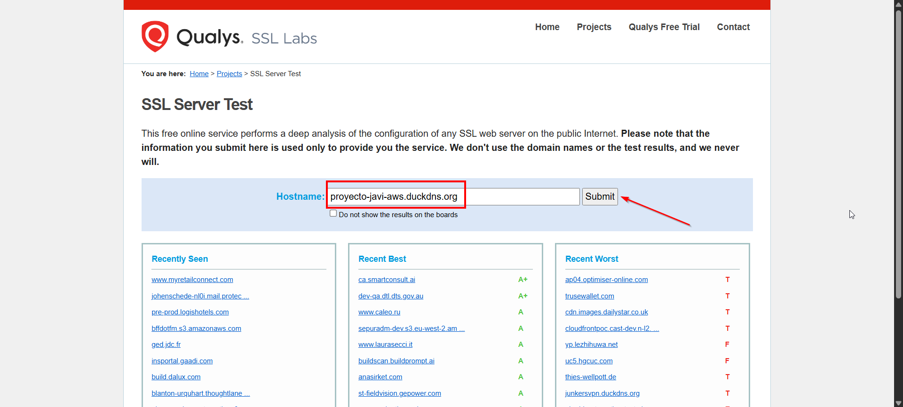
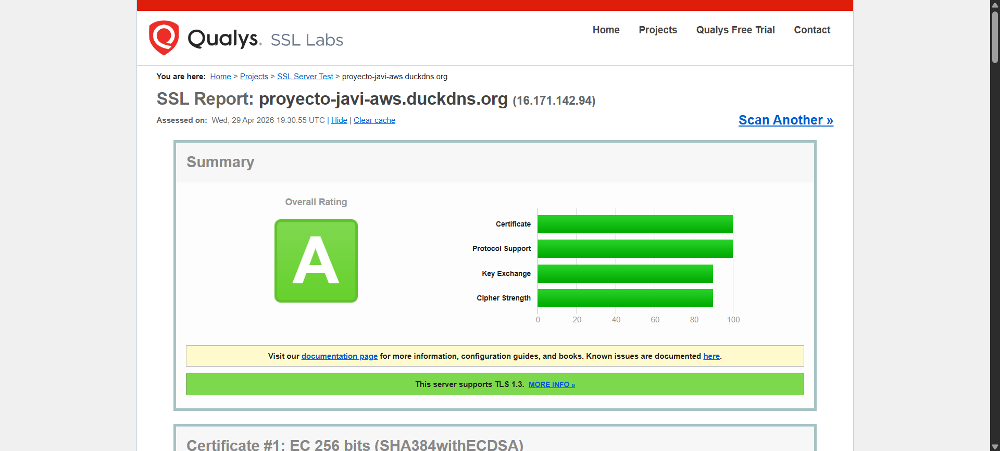
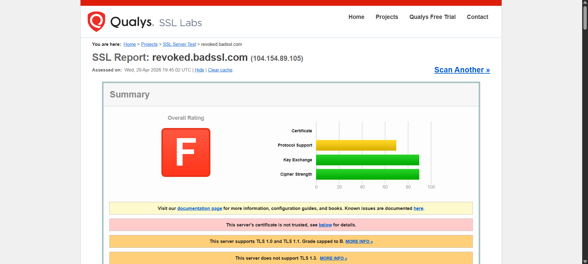
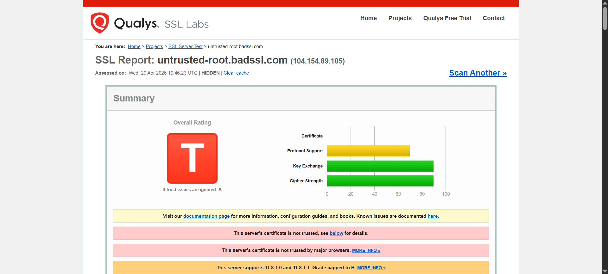
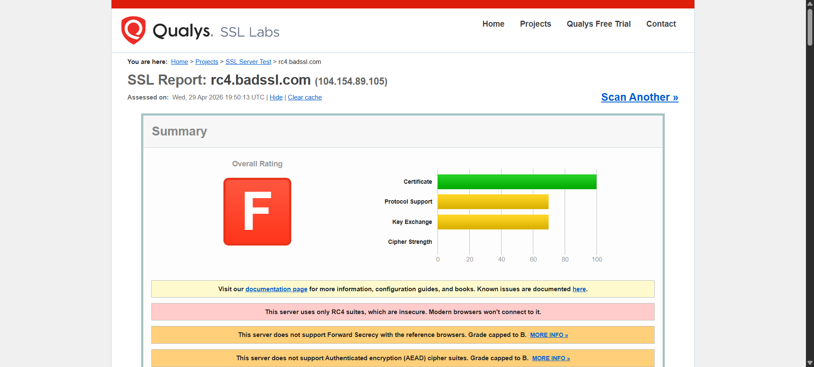

# Proyecto 9 - Análisis SSL (Parte 3)

**Fecha:** 29 de abril de 2026  
**Autor:** Javier Calvillo  

## Índice

1. [Introducción](#1-introducción)
2. [Análisis del certificado del servidor](#2-análisis-del-certificado-del-servidor)
3. [Certificados inválidos](#3-certificados-inválidos)
   - [3.1. Certificado Revocado](#31-certificado-revocado)
   - [3.2. Autoridad Raíz No Confiable](#32-autoridad-raíz-no-confiable)
   - [3.3. Algoritmo de Cifrado Obsoleto (RC4)](#33-algoritmo-de-cifrado-obsoleto-rc4)
4. [Conclusión](#4-conclusión)

---

## 1. Introducción

En esta última parte del proyecto, el objetivo principal es realizar una auditoría de seguridad del servidor web que hemos configurado previamente en AWS. Para ello, utilizaremos la herramienta externa de **Qualys SSL Labs**, que nos permitirá comprobar de manera exhaustiva si la implementación de HTTPS en nuestro servidor es realmente robusta y correcta.

Además, con el objetivo de profundizar en los posibles fallos de configuración, investigaré y analizaré tres sitios web que poseen certificados digitales defectuosos por distintos motivos técnicos. La idea es identificar por qué fallan, cómo los clasifica la herramienta de análisis y comprender las implicaciones de seguridad que tienen este tipo de errores.

## 2. Análisis del certificado del servidor

Para confirmar que la configuración de mi servidor era óptima tras instalar Apache y Certbot, he sometido a mi dominio (`proyecto-javi-aws.duckdns.org`) al escáner de SSL Labs.

**Resultado del análisis:**
El análisis de Qualys SSL Labs ha evaluado de forma positiva mi configuración, otorgándole a mi servidor la calificación global de **"A"**. 

Esta excelente nota demuestra que el certificado de Let's Encrypt ha sido instalado correctamente y que el servidor web está configurado utilizando protocolos modernos y seguros. La herramienta ha verificado con éxito la solidez de la cadena de confianza, la fuerza del cifrado y la resistencia ante vulnerabilidades conocidas, dando el visto bueno completo a la conexión.

**Evidencias:**

*Introducción de mi dominio en la herramienta:*

*Resultado final mostrando la calificación A:*

## 3. Certificados inválidos

Para entender qué ocurre cuando los administradores de sistemas cometen fallos, he recurrido al portal educativo *badssl.com*, que mantiene varios subdominios configurados intencionalmente con fallos de seguridad. A diferencia del enfoque básico, he decidido analizar tres errores técnicos bastante críticos e interesantes.

### 3.1. Certificado Revocado

He analizado el subdominio `revoked.badssl.com`.

**Problema detectado:**
El certificado de esta página web ha sido **revocado** (anulado) de forma explícita por la Autoridad de Certificación (CA) antes de que llegara su fecha de vencimiento natural.

**Explicación y consecuencias:**
Este tipo de error, que en SSL Labs da una calificación letal de **F**, suele ocurrir en el mundo real cuando una empresa o propietario sospecha que la clave privada de su servidor ha sido robada, hackeada o filtrada. Para evitar suplantaciones de identidad, se contacta a la CA para invalidar el certificado. Los navegadores web modernos, al consultar las listas de revocación (CRLs) o mediante OCSP, bloquean automáticamente el acceso a estos sitios para proteger al usuario, mostrando una alerta roja de seguridad ineludible.

**Evidencia:**

### 3.2. Autoridad Raíz No Confiable

El segundo sitio que he analizado ha sido `untrusted-root.badssl.com`.

**Problema detectado:**
El certificado tiene un formato técnicamente correcto, pero está firmado por una **Autoridad de Certificación desconocida** que no se encuentra en el almacén de entidades de confianza que viene preinstalado en nuestro navegador o sistema operativo.

**Explicación y consecuencias:**
La herramienta SSL Labs marca este error indicando un mensaje de advertencia, pero la calificación principal muestra una gran **T** roja (Trust issues) alertando de problemas de confianza. Para que un certificado sea aceptado en internet, el navegador debe poder trazar la "cadena de confianza" hasta llegar a un emisor raíz que conozca (por ejemplo, Let's Encrypt, DigiCert, etc.). Si la CA raíz es un ente desconocido, la cadena se rompe y el navegador rechaza la conexión, indicando al usuario que "la conexión no es privada" ya que no puede asegurar quién es el verdadero dueño del servidor.

**Evidencia:**

### 3.3. Algoritmo de Cifrado Obsoleto (RC4)

Finalmente, he auditado la seguridad del sitio `rc4.badssl.com`.

**Problema detectado:**
En este caso, el fallo no está en la identidad del emisor ni en la validez del documento, sino en los algoritmos criptográficos que el servidor ofrece para cifrar los datos. El servidor está configurado para usar exclusivamente **RC4**, un sistema de cifrado extremadamente antiguo.

**Explicación y consecuencias:**
Este grave error da como resultado una calificación de **F** en el escáner. RC4 ha demostrado ser extremadamente frágil frente a múltiples ataques criptográficos y hace bastantes años que fue declarado obsoleto y prohibido por la industria de la ciberseguridad. Como medida de protección, cualquier navegador moderno (como Chrome o Firefox) abortará inmediatamente la conexión con un servidor que pretenda usar RC4, ya que es incapaz de garantizar la privacidad y confidencialidad de la información transmitida.

**Evidencia:**

## 4. Conclusión

Este análisis mediante SSL Labs me ha permitido validar desde una perspectiva técnica y externa que el trabajo de configuración de servidor que hice en la parte anterior es sólido y completamente funcional. 

Además, el estudio de los certificados inválidos en *badssl.com* ha sido muy enriquecedor a nivel formativo. Comprobar personalmente los efectos de un certificado revocado, una cadena de confianza rota por falta de autoridad raíz o el uso de algoritmos obsoletos como RC4 ayuda a comprender un concepto vital: la seguridad en internet no se limita únicamente a adquirir y poner un certificado en el servidor. Es imprescindible mantener una buena higiene criptográfica, configuraciones rigurosas y descartar tecnologías obsoletas para que las conexiones sean verdaderamente fiables.
